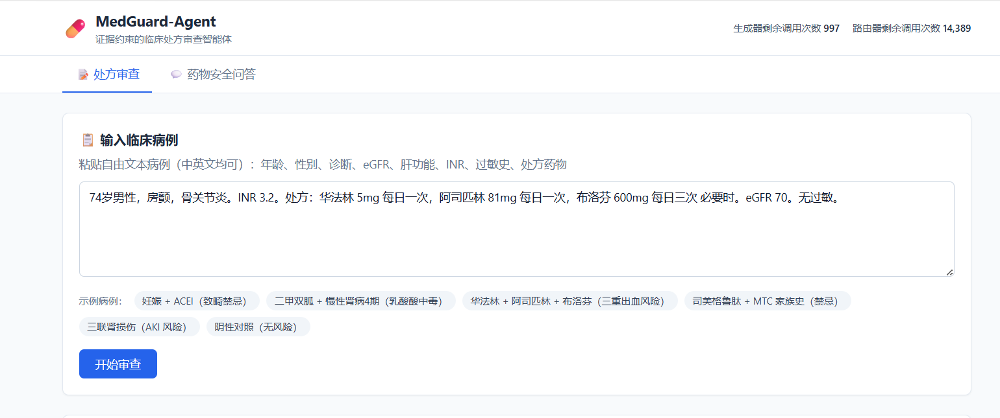
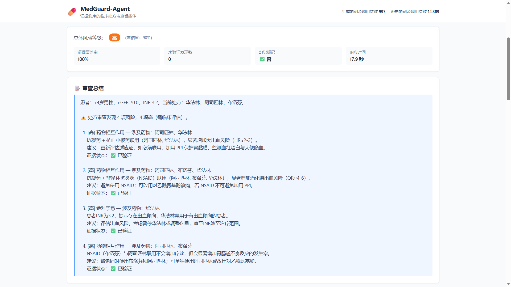
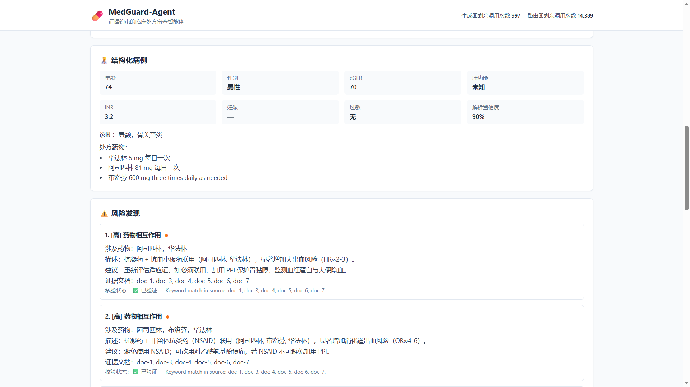
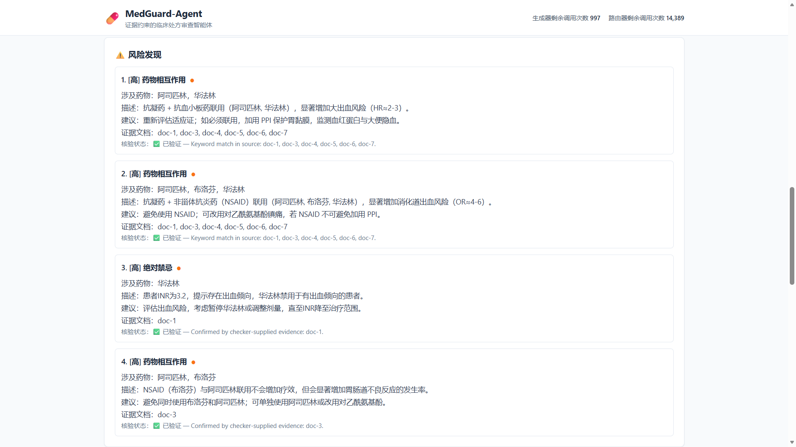
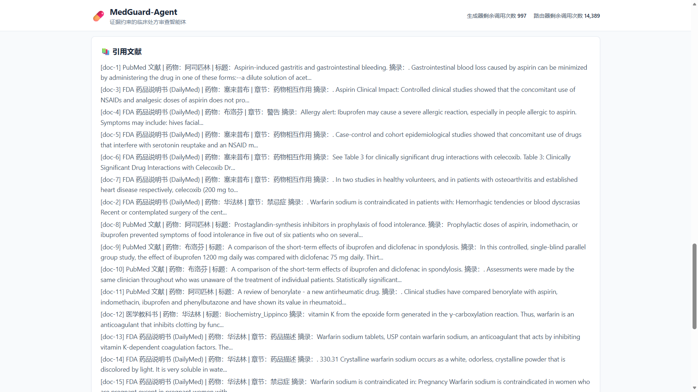

# MedGuard-Agent — Evidence-Constrained Clinical Prescription Review Agent

> **Origin.** MedGuard-Agent extends [PharmAgent](#pharmagent--autonomous-drug-safety-intelligence)
> (an autonomous drug-safety QA agent built on LangGraph + agentic RAG) into a **structured
> clinical prescription review agent**. The original drug-safety QA pipeline is preserved
> verbatim; the new `pharmagent.prescription` subpackage layers a case parser, prescription
> risk checker, and evidence verifier on top of the same retrieval + grading infrastructure.

> **What it does.** Given a free-text clinical case (patient demographics, diagnoses, labs,
> allergies, and a prescription), MedGuard-Agent parses the case, retrieves evidence from
> FDA labels / PubMed / StatPearls, runs deterministic + LLM-driven risk checks, verifies
> every finding against retrieved sources, and emits a structured prescription-review report
> with risk level, per-finding evidence links, and a hallucination flag for unverified
> high-severity findings.

> **Who is this for?** You don't need a pharma background to understand this. If you've ever Googled "is it safe to take drug X with drug Y?" and gotten a confusing wall of text, this project automates that research — but at a clinical level, across thousands of medical documents, in under 60 seconds.

---

## MedGuard-Agent at a Glance

| Input | Output |
|---|---|
| Free-text clinical case (age, sex, diagnoses, eGFR, liver function, INR, allergies, prescription) | Structured `PrescriptionReport`: overall risk level, list of `PrescriptionFinding` (type, severity, drugs, recommendation, evidence doc IDs, verified flag), evidence coverage, hallucination flag, citations, elapsed time |

**Risk axes covered:** drug-drug interactions, absolute contraindications, dose risks,
renal risks, hepatic risks, pregnancy/lactation risks, allergy cross-reactivity, and
monitoring needs. Each finding is verified against at least one retrieved source document
before being marked `verified=True`.

### Prescription Review Pipeline (7-node LangGraph)

```
Clinical case (free text)
    │
    ▼
┌─────────────────────┐
│  Node 1: Parse Case │  LLM + regex fallback → PatientCase
│                     │  (age, sex, eGFR, liver function, drugs, allergies…)
└─────────┬───────────┘
          ▼
┌─────────────────────┐
│  Node 2: Build      │  Per-drug, per-pair, per-diagnosis sub-queries
│  Sub-Queries        │  (patient context-aware)
└─────────┬───────────┘
          ▼
┌─────────────────────┐
│  Node 3: Retrieve   │  Hybrid search (BM25 + ChromaDB + RRF + rerank)
│                     │  across all sub-queries, deduped
└─────────┬───────────┘
          ▼
┌─────────────────────┐
│  Node 4: Grade Docs │  LLM relevance grading (reuses PharmAgent grader)
└─────────┬───────────┘
          ▼
┌─────────────────────┐
│  Node 5: Check      │  Deterministic rules (pregnancy, renal, INR, MTC,
│  Prescription       │  allergy, triple-whammy, hepatotoxic) + LLM-driven
│                     │  findings grounded in retrieved evidence
└─────────┬───────────┘
          ▼
┌─────────────────────┐
│  Node 6: Verify     │  Per-finding evidence audit: checker-supplied IDs
│  Evidence           │  → keyword pre-check → LLM verifier fallback
└─────────┬───────────┘
          ▼
┌─────────────────────┐
│  Node 7: Compile    │  PrescriptionReport: risk level, findings, evidence
│  Report             │  coverage, hallucination flag, citations, latency
└─────────┬───────────┘
          ▼
     Final Prescription Review Report
```

### Deterministic Safety Rules (always enforced)

The deterministic layer guarantees known absolute contraindications can never be silently
under-reported by the LLM:

| Rule | Trigger | Severity |
|---|---|---|
| Pregnancy teratogen | ACE inhibitor / ARB / warfarin / methotrexate + `pregnancy=true` | critical |
| Metformin + severe CKD | metformin + eGFR < 30 | critical |
| Metformin + moderate CKD | metformin + eGFR 30–45 | high (renal_risk) |
| Anticoagulant + antiplatelet | warfarin/DOAC + aspirin/clopidogrel | high |
| Anticoagulant + NSAID | warfarin/DOAC + ibuprofen/naproxen/… | high |
| Supratherapeutic INR | INR ≥ 4 with concurrent bleeding-risk drug | high (≥5 → critical) |
| GLP-1 + MTC/MEN 2 | semaglutide/liraglutide + personal/family history | critical |
| Allergy exact match | documented allergy on current prescription | critical |
| Penicillin → cephalosporin | penicillin allergy + cephalosporin prescribed | moderate |
| Triple-whammy renal | NSAID + ACE inhibitor/ARB + eGFR < 60 | moderate / high |
| Hepatotoxic in impaired liver | acetaminophen/statin/INH + moderate/severe liver | moderate / high |

### Run a Prescription Review

```python
from pharmagent.prescription.graph import run_prescription_review

case_text = """
68-year-old male with type 2 diabetes and CKD stage 4. eGFR 18 mL/min/1.73m^2.
Current prescription: metformin 1000 mg BID, glipizide 5 mg daily.
No known allergies. Liver function normal.
"""

report = run_prescription_review(case_text)
print(report.overall_risk_level)        # 'critical'
print(report.evidence_coverage)         # fraction of findings with a supporting doc
print(report.hallucination_flagged)     # True if any high/critical finding lacks evidence
for f in report.findings:
    print(f.severity, f.finding_type, f.drugs_involved, f.verified)
```

### Prescription Review Evaluation

```bash
python -m pharmagent.evaluation.prescription_eval
```

Computes Precision / Recall / F1 (micro and macro), evidence hit rate, hallucination rate
(fraction of high/critical findings without evidence support), and average response time
across a 7-case golden set covering pregnancy, severe CKD, triple bleeding combinations,
black-box warnings, allergy cross-reactivity, triple-whammy renal injury, and a negative
control. Reports are written to `data/prescription_eval_results.json` and
`prescription_eval_results.md`.

### Prescription Review Target KPIs

| Metric | Target | What it measures |
|---|---|---|
| Micro F1 (finding-level) | > 0.80 | Are the right risks flagged? |
| Macro Recall | > 0.85 | Are expected findings missed? |
| Evidence hit rate | > 0.80 | Fraction of findings backed by a retrieved source |
| Hallucination rate (high/critical) | < 0.10 | Fraction of severe findings lacking evidence |
| Average response time | < 30 s | End-to-end review latency per case |

---

## PharmAgent — Autonomous Drug Safety Intelligence

The sections below describe the original PharmAgent drug-safety QA pipeline that
MedGuard-Agent inherits as its retrieval + grading backbone. The original 6-node agent
graph (`pharmagent.agent.graph`) and the new prescription review graph
(`pharmagent.prescription.graph`) coexist; both can be invoked independently.

---

## The Business Problem

### What happens today (without AI)

A hospital pharmacist or pharmaceutical company safety officer is asked: *"Is it safe for a 68-year-old patient with kidney disease to take metformin, lisinopril, and warfarin together?"*

To answer this responsibly, they must:

1. Search FDA's DailyMed for each drug's label (warnings, dosing adjustments, contraindications)
2. Cross-reference drug-drug interaction databases
3. Check medical literature (PubMed) for published studies on this combination
4. Review clinical guidelines for kidney disease-specific recommendations
5. Synthesize all findings into a safety assessment

**This takes 2–4 hours per query.** In a hospital setting, dozens of these reviews happen daily. At pharmaceutical companies, safety officers review thousands of drug combinations for trial design, regulatory submissions, and adverse event monitoring.

### Why this is dangerous and expensive

- **Speed**: Delayed reviews slow clinical trials, drug approvals, and patient care
- **Inconsistency**: Different analysts reading the same documents reach different conclusions
- **Scale**: A drug with 10 known interactions creates 45 unique pair combinations; with 100 drugs it's 4,950 pairs
- **Hallucination risk**: Off-the-shelf AI (like ChatGPT) confidently invents drug interactions that don't exist — in healthcare, a wrong answer can harm patients

---

## Our Solution: PharmAgent

PharmAgent is an **Agentic RAG (Retrieval-Augmented Generation) system** that autonomously:

1. Decomposes complex drug safety questions into targeted sub-queries
2. Retrieves evidence from three distinct medical knowledge bases simultaneously
3. Grades every retrieved document for relevance (discards irrelevant chunks)
4. Self-corrects when retrieval fails by rewriting the query
5. Synthesizes a structured safety assessment with citations
6. Verifies its own answer against source documents before returning it

**Result: Drug safety reviews in under 60 seconds, with every claim cited to a source document.**

### Why not just use ChatGPT?

Standard AI (vanilla RAG) fails on this problem because:

| Problem | Why vanilla RAG fails | How PharmAgent solves it |
|---|---|---|
| Multi-source reasoning | Single retrieve-then-answer pass can't cross-reference 3 databases | Routes sub-queries to the right knowledge base |
| Hallucination | LLMs invent plausible-sounding interactions | Hallucination grader rejects uncited claims |
| Query complexity | "Is it safe for a patient with X condition taking Y and Z?" requires parallel reasoning | Query decomposition breaks it into answerable sub-questions |
| Out-of-vocabulary drugs | AI guesses when it doesn't know | Hard rejection with explicit warning for unknown drugs |
| False premises | "What dose reduction prevents serotonin syndrome from warfarin + lisinopril?" (serotonin syndrome is impossible here) | Agent detects and rejects the false premise rather than inventing an answer |

---

## What We Built

### Architecture: 6-Node Agentic Loop (LangGraph)

```
User Query
    │
    ▼
┌─────────────────────┐
│  Node 1: Analyze    │  Classifies query type, identifies drugs,
│  & Route            │  selects knowledge bases to search
└─────────┬───────────┘
          │ valid query          invalid query ──► REJECT (with reason)
          ▼
┌─────────────────────┐
│  Node 2: Retrieve   │  Hybrid search (BM25 + dense vectors) across
│                     │  FDA labels, PubMed, clinical guidelines
└─────────┬───────────┘
          ▼
┌─────────────────────┐
│  Node 3: Grade Docs │  LLM scores each chunk for relevance
│                     │  Irrelevant chunks discarded
└─────────┬───────────┘
          │ enough relevant docs?
          │ NO ──► ┌──────────────────┐
          │        │ Node 4: Rewrite  │ ──► back to Node 2 (max 2 retries)
          │        └──────────────────┘
          │ YES
          ▼
┌─────────────────────┐
│  Node 5: Generate   │  Llama 3.3 70B synthesizes structured
│                     │  safety assessment with inline citations
└─────────┬───────────┘
          ▼
┌─────────────────────┐
│  Node 6: Check      │  Verifies: (a) every claim is in source docs
│  Hallucination      │  (b) answer actually addresses the question
└─────────┬───────────┘
          │ failed? ──► back to Node 5 (max 1 retry)
          │ passed?
          ▼
     Final Safety Assessment
     (Risk Level · Evidence · Contraindications · Monitoring · Citations)
```

### Three Knowledge Bases

| Source | What it contains | Why we use it |
|---|---|---|
| **FDA DailyMed** | Official drug package inserts (~150,000 drugs) | Ground truth for warnings, dosing, contraindications |
| **PubMed (MedRAG)** | 23.9M biomedical research snippets | Published evidence for interactions and adverse events |
| **StatPearls** | 9,330 clinical reference articles | Evidence-based clinical guidelines and protocols |

### Retrieval: Hybrid Search

Each knowledge base uses **hybrid search** combining:
- **BM25** (keyword matching) — catches exact drug name and medical term matches
- **Dense vector search** (semantic similarity via `all-MiniLM-L6-v2` embeddings in ChromaDB) — catches conceptual matches even when exact words differ
- **Reciprocal Rank Fusion (RRF)** — merges both result lists into a unified ranking
- **Cross-encoder reranking** — final precision pass before documents reach the grader

### LLM Strategy (Cost-Optimized)

| Task | Model | Reason |
|---|---|---|
| Query classification, grading, hallucination check | Llama 3.1 8B (Groq) | Fast, cheap, sufficient for structured binary decisions |
| Safety assessment synthesis | Llama 3.3 70B (Groq) | Maximum reasoning capability for the critical generation step |

**Total cost: $0.** Everything runs on Groq's free tier.

---

## What We Achieved: Evaluation Results

We tested PharmAgent against 5 complex pharmacovigilance scenarios designed to stress-test the system. Target drugs: **Aspirin, Lisinopril, Metformin, Semaglutide, Warfarin**.

| Test Case | Query Type | Result | Risk Level Returned | Notes |
|---|---|---|---|---|
| Semaglutide + Warfarin (pharmacokinetic mechanism) | Multi-hop reasoning | Safe Failure | MODERATE (50%) | Did NOT hallucinate the mechanism. Correctly admitted missing data. |
| Aspirin + Lisinopril post-MI with CKD | Guideline contradiction | Partial Success | MODERATE (60%) | Identified drug clash; missed guideline retrieval |
| Lisinopril + Warfarin → "Serotonin Syndrome" | False premise detection | **Complete Success** | Rejected false premise | Refused to invent a non-existent interaction |
| Metformin + Lisinopril + Dehydration (lactic acidosis risk) | Environmental trigger → biochemical cascade | **Strong Success** | HIGH (80%) | Correctly connected dehydration → AKI → lactic acidosis |
| Aspirin + Warfarin + Fish Oil + OTC cold meds (triple threat) | Multi-part out-of-vocabulary | Safe Failure | HIGH (40%) with OOV warning | Correctly flagged unknown ingredients; flagged GI bleed risk |

### Key Findings

**What works exceptionally well:**
- **Hallucination prevention**: The system refuses to invent medical mechanisms when source documents don't support them. In the false-premise test (serotonin syndrome), it correctly rejected the question rather than fabricating an answer.
- **Safety-first failure mode**: When the system can't fully answer, it returns a conservative risk level with explicit uncertainty rather than a confident wrong answer.
- **Out-of-vocabulary handling**: Unknown drugs trigger explicit warnings ("This drug is NOT in the knowledge base") instead of silent guesses.

**Current limitations:**
- **Multi-hop decomposition**: Complex queries requiring the agent to first look up a mechanism (e.g., "semaglutide slows gastric emptying") and then apply it to a second drug interaction require explicit query decomposition that the current router doesn't always perform.
- **5-drug scope**: The demo knowledge base covers only 5 drugs. Scaling to the full DailyMed library requires production infrastructure.

---

## Technology Stack

| Component | Technology | Why |
|---|---|---|
| Agent orchestration | LangGraph | Industry standard for stateful, cyclic AI workflows with checkpointing |
| LLM inference | Groq API (free tier) | Sub-second latency; Llama 3.3 70B quality at zero cost |
| Vector database | ChromaDB | Zero-config, embedded, Apache 2.0 licensed |
| Keyword search | rank-bm25 | Complementary to dense retrieval; critical for exact drug name matching |
| Embeddings | all-MiniLM-L6-v2 (sentence-transformers) | Free local inference; biomedical text performance sufficient for this scope |
| Drug label data | DailyMed (NLM) | Official FDA-approved drug package inserts |
| Literature data | MedRAG/PubMed (HuggingFace) | Pre-processed for RAG; 23.9M snippets |
| Clinical guidelines | MedRAG/StatPearls (HuggingFace) | Peer-reviewed clinical reference |
| Evaluation | RAGAS + DeepEval | Open-source RAG evaluation; measures faithfulness, context precision |
| UI | Streamlit | Rapid deployment; free hosting on Community Cloud |
| Observability | Langfuse (self-hosted) | Traces every agent decision, retrieval, and generation step |
| Configuration | pydantic-settings | Type-safe environment variable management |
| Logging | structlog | Structured JSON logs for every agent node decision |

---

## Quick Start

### Prerequisites

- Python 3.11+
- [Groq API key](https://console.groq.com) (free, no credit card required)

### Install

```bash
git clone https://github.com/<your-username>/pharma-agent.git
cd pharma-agent
pip install -e ".[dev]"
```

### Configure

```bash
cp .env.example .env
# Add your GROQ_API_KEY to .env
```

### Ingest Demo Data (5 drugs)

```bash
python scripts/ingest_demo.py
```

This downloads and indexes FDA labels for Aspirin, Lisinopril, Metformin, Semaglutide, and Warfarin into ChromaDB and BM25 stores.

### Run the UI

```bash
streamlit run pharmagent/ui/app.py
```

### Run Evaluation

```bash
pip install -e ".[eval]"
python pharmagent/evaluation/run_eval.py
```

---

## 界面演示 / UI Showcase

React + TypeScript + Tailwind CSS 前端，完全中文化界面。下方截图展示主要使用流程。

### 主界面



### 处方审查 — 病例输入



### 处方审查 — 风险报告



### 药物安全问答



### 评估结果



---

## Project Structure

```
pharmagent/
├── agent/
│   ├── graph.py        # LangGraph state graph definition (the 6-node loop)
│   ├── nodes.py        # Each node's logic (analyze, retrieve, grade, rewrite, generate, check)
│   ├── state.py        # AgentState TypedDict
│   └── llm.py          # LLM clients + token budget tracker
├── core/
│   ├── hybrid_retriever.py     # BM25 + ChromaDB fusion with cross-encoder reranking
│   ├── document_grader.py      # LLM-based relevance scoring
│   ├── query_rewriter.py       # Query reformulation for failed retrievals
│   ├── synthesizer.py          # Safety assessment generation
│   ├── hallucination_checker.py # Faithfulness + answer relevance verification
│   ├── safety_guardrails.py    # Deterministic guardrails (OOV detection, risk escalation)
│   ├── schemas.py              # SafetyAssessment Pydantic model
│   ├── vectorstore.py          # ChromaDB client
│   ├── bm25_store.py           # BM25 index persistence
│   └── embeddings.py           # Sentence-transformer embeddings
├── prescription/               # MedGuard-Agent: clinical prescription review
│   ├── schemas.py              # PatientCase / PrescriptionFinding / PrescriptionReport / VerificationResult
│   ├── case_parser.py          # Free-text case → structured PatientCase (LLM + regex fallback)
│   ├── prescription_checker.py # Deterministic rules + LLM-driven risk findings
│   ├── evidence_verifier.py    # Per-finding evidence audit (checker IDs → keyword → LLM verifier)
│   ├── state.py                # PrescriptionState TypedDict
│   └── graph.py                # 7-node prescription review LangGraph
├── ingestion/
│   ├── dailymed.py     # DailyMed XML download and parsing
│   ├── medrag_loader.py # PubMed + StatPearls HuggingFace dataset loader
│   ├── chunker.py      # Text chunking for drug labels
│   └── build_index.py  # Full index build pipeline
├── evaluation/
│   ├── golden_set.py                # Ground truth Q&A pairs (original agent)
│   ├── run_eval.py                  # RAGAS + DeepEval evaluation runner (original agent)
│   ├── prescription_golden_set.py   # 7 prescription review cases with expected findings
│   └── prescription_eval.py         # P/R/F1 + evidence hit + hallucination + latency runner
└── ui/
    └── app.py          # Streamlit interface
scripts/
└── ingest_demo.py      # One-command demo data ingestion
```

---

## Example Queries

Try these in the Streamlit UI:

- *"What are the contraindications for metformin in patients with renal impairment?"*
- *"What are the risks of taking warfarin and aspirin together?"*
- *"Is semaglutide safe for a patient with a history of pancreatitis?"*
- *"Is metformin safe for a 68-year-old patient with stage 3 CKD who is also taking lisinopril and warfarin?"*
- *"A patient taking metformin develops severe vomiting and dehydration — what are the immediate biochemical dangers?"*

---

## Target KPIs

| Metric | Target | What it measures |
|---|---|---|
| Review time per query | < 60 seconds | Speed vs. 2–4 hour manual baseline |
| Retrieval Precision@10 (RAGAS) | > 0.75 | Are the right documents retrieved? |
| Faithfulness score (RAGAS) | > 0.90 | Are all claims grounded in source documents? |
| Hallucination rate | < 6% | How often does the system invent unsupported facts? |
| Multi-hop accuracy | > 85% | Complex multi-drug queries answered correctly vs. pharmacist ground truth |

---

## Stakeholders

This tool is designed for:

- **Hospital pharmacists** conducting medication reconciliation
- **Pharmaceutical safety officers** reviewing adverse event signals  
- **Clinical researchers** evaluating drug combinations for trial design
- **Regulatory affairs teams** preparing FDA submissions

---

## License

MIT
